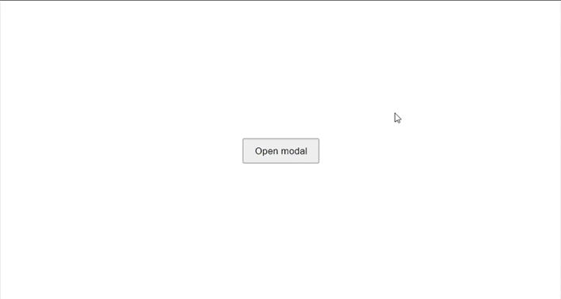

# A modal React component with customizable text content

## About

This is a simple modal component made as part of a react project
this modal is used to display a message when open
you can choose the message and the theme for the close button

## Installation

You can install this component with npm or yarn:

    npm i simple-react-modal-by-assamoi

or

    yarn add simple-react-modal-by-assamoi

## Example

```js
import React, { useState } from "react";
import { Modal } from "simple-react-modal-by-assamoi";

export default function App() {
  const [open, setOpen] = useState(false);

  // Choose modal text content
  const ModalContent = "You can write the content of your modal here !!";

  // Choose modal theme for close button
  const myTheme = {
    closeBtnColor: "#ffffff",
    closeBtnBgColor: "#008000",
  };

  return (
    <div>
      <button onClick={() => setOpen(true)} className="modal-btn">
        Open modal
      </button>
      <Modal
        open={open}
        content={ModalContent}
        theme={myTheme}
        onClose={() => setOpen(false)}
      />
    </div>
  );
}
```

## Demo


